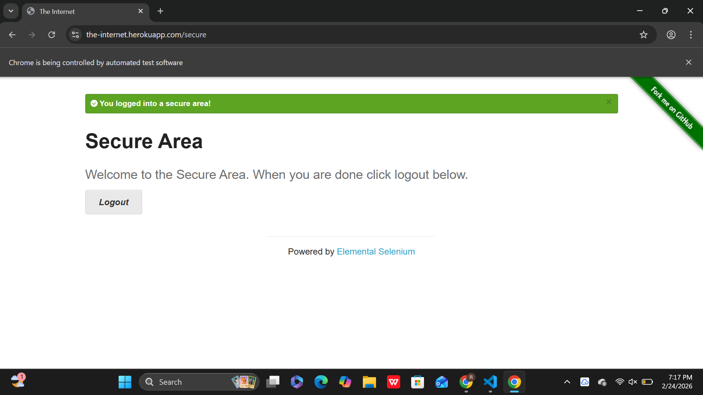
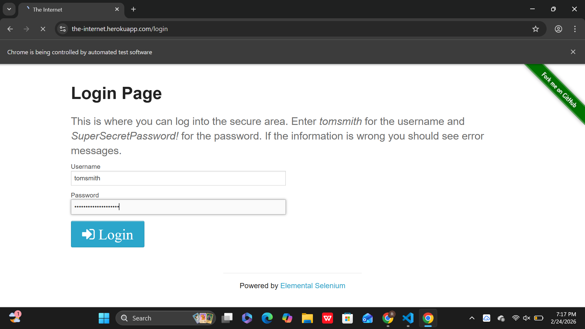
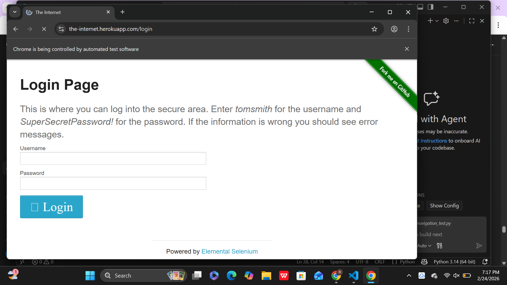

# 🚀 Test Automation Using Selenium

## 🏢 Company Details
- **Company Name:** CODTECH IT SOLUTIONS  
- **Intern Name:** Garnepudi Renuka Rani  
- **Intern ID:** CTIS55575  
- **Domain:** Software Testing  
- **Duration:** 4 Weeks  
- **Mentor:** Neela Santosh  

---

## 📌 Project Title
**Test Automation Using Selenium**

---

## 🎯 Objective
To automate the testing of a sample web application's login and navigation functionality using Selenium WebDriver.

---

## 📖 Project Description
This project demonstrates automated web testing using Selenium WebDriver with Python.

The automation verifies:

- ✅ Successful login functionality  
- ✅ Navigation to the secure page after login  
- ✅ Proper execution without manual intervention  
- ✅ Completion of internship task requirements  

---

## 🛠 Tools & Technologies Used
- **Programming Language:** Python  
- **Automation Tool:** Selenium WebDriver  
- **Browser:** Mozilla Firefox  
- **Driver:** GeckoDriver  

---

## 🌐 Test Application Details
- **URL:** https://the-internet.herokuapp.com/login  
- **Username:** tomsmith  
- **Password:** SuperSecretPassword!  

---

## ⚙ Automation Steps Performed
1. Launch Firefox browser using Selenium WebDriver  
2. Open the login page  
3. Enter valid username and password  
4. Submit the login form  
5. Verify successful login by checking secure page text  
6. Logout from the application  
7. Print execution status in terminal  
8. Close the browser  

---

## 📝 Test Execution Report

### ✅ Test Case 1: Login Functionality
**Steps:**
1. Open browser  
2. Navigate to login page  
3. Enter valid username and password  
4. Click login button  

**Result:** Login successful  
**Status:** PASS ✅  

---

### ✅ Test Case 2: Navigation / Logout Functionality
**Steps:**
1. Click logout button after login  

**Result:** User navigated back to login page  
**Status:** PASS ✅  

---

## 📂 Files in Repository
- `login_navigation_test.py` – Selenium automation script  
- `Test_Execution_Report.txt` – Execution report  
- `SS1_login_page.png`  
- `SS2_login_success1.png`  
- `SS3_login_success2.png`  
- `README.md`  

---

## Screenshots

### Login Page

### Login Success 1

### Login Success 2

## 🏁 Conclusion
The Selenium automation script successfully tested the login and navigation functionality of the sample web application.  
This project demonstrates practical implementation of automated web testing using Selenium WebDriver and Python as part of the CODTECH Internship Program.
